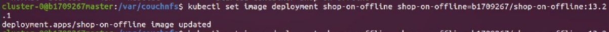

> ## GIỚI THIỆU ĐỀ TÀI AUTOSCALING WEB APPLICATION WITH KUBERNETES

---------------------------------------------------------------------------------------------------------------------------------------
<sup> Demo phần chính (đã tua nhanh): [tại đây](https://drive.google.com/file/d/1shEI7kFjrFlJoUj_KfXXO-9xJzfUEJhx/view?usp=sharing) </sup>
<br><sup> Full quá trình cài đặt (đã tua nhanh): [tại đây](https://drive.google.com/file/d/1NUq_zmT64qH7WNe3ovXiGi2vCUiTOXSg/view?usp=sharing) </sup>
<br><sup> Folder Video Demo: [tại đây](https://drive.google.com/drive/folders/1A7YhtJBNtjBSUF-JNhmN5O-ulbRX6gQY?usp=sharing) </sup>
---------------------------------------------------------------------------------------------------------------------------------------
<sup>***Note:
<br>Xin phép không để source code Web App `Shop-on-offline` tại đây vì đề tài này có `2 phân hệ` và đó là `phân hệ 1`, đề tài của 1 bạn khác.
<br>Xem trong file `Word` hoặc file `PDF` để ảnh rõ hơn.***
</sup>
<br><br>

_________
> ### 1. MỤC TIÊU ĐỀ TÀI
Với đề tài `“Mở rộng tự động quy mô ứng dụng Web với Kubernetes”`, các
mục tiêu được đề ra là:
- _Hiểu được các kiến thức về `Kubernetes`, `Docker`, `CouchDB Cluster`._
- _Triển khai thành công `CouchDB Cluster` và ứng dụng Web lên
`Kubernetes`._
- _Biết cách tạo `image` với `Docker`, đóng gói ứng dụng Web và triển khai
trên `Kubernetes`._
- _Hiểu công dụng của `AutoScaler` trong `Kubernetes` và cách scale tự động
ứng dụng Web._
> ### 2. NỘI DUNG NGHIÊN CỨU
Nội dung nghiên cứu bao gồm các phần:
- _Phân tích và nghiên cứu kiến thức._
- _Tiến hành cài đặt `Kubernetes Cluster` trên `Ubuntu`._
- _Triển khai `CouchDB Cluster`, cài đặt `Scale` tự động `CouchDB
Cluster`._
- _Triển khai ứng dụng Web, cài đặt `Scale` tự động ứng dụng Web._
- _Kiểm tra và đánh giá sự hoạt động của `CouchDB Cluster` và ứng
dụng Web sau khi `Scale`._
> ### 3. BỐ CỤC CỦA LUẬN VĂN
Bố cục luận văn được chia thành các phần:
- _**Phần giới thiệu:** Đặt vấn đề, đưa ra mục tiêu đề tài._
- _**Phần nội dung:** Mô tả bài toán, các cơ sở lý thuyết được áp dụng,
phương pháp thực hiện._
- _**Phần kết luận:** Kết quả đạt được, các mặt hạn chế và phương
hướng phát triển tiếp theo._

#### Quá trình nghiên cứu và thực hiện trải qua 4 giai đoạn:
##### `Giai đoạn 1: Tìm hiểu sơ lược về Docker và Kubernetes.`

Đây là đoạn lý thuyết về `Docker` và `Kubernetes`, xin phép lượt bỏ đoạn này. Xem chi tiết trong file `word` hoặc file `PDF`.

##### `Giai đoạn 2: Tiến hành cài đặt Docker và Kubernetes.`

Ở giai đoạn này, tiến hành tạo `3 máy ảo Ubuntu`, cấu hình mạng trên 3 máy.
Cài đặt và cấu hình sau khi đã tìm hiểu những khái niệm căn bản về `Docker` và
`Kubernetes`. Hệ điều hành mà em lựa chọn là `Ubuntu 20.04.17`

Chi tiết máy ảo:
- _**Máy Master:** IP là `192.168.1.100`, 30GB bộ nhớ, `RAM 4GB`, `2
CPU`._
- _**Máy Worker 1:** IP là `192.168.1.101`, 30GB bộ nhớ, `RAM 3GB`, `2
CPU`._
- _**Máy Worker 2:** IP là `192.168.1.102`, 30GB bộ nhớ, `RAM 3GB`, `2
CPU`._

##### `Giai đoạn 3: Triển khai CouchDB Cluster lên Kubernetes, cài đặt scale tự động CouchDB.`

Tìm hiểu các phiên bản CouchDB được Docker hỗ trợ sau đó tạo Container
trên Kubernetes và tiến hành cấu hình Cluster cho CouchDB. Cài đặt scale tự động
khi có Container bị lỗi hoặc lưu lượng truy cập quá lớn khiến Server bị quá tải.

##### `Giai đoạn 4: Triển khai ứng dụng Web lên Kubernetes, cài đặt scale tự động ứng dụng Web.`

Ở giai đoạn này, đầu tiên cần biết cách tạo `Docker Image` và cách đẩy
`Image` lên `Docker Hub`. Tiến hành tạo `Docker Image` cho ứng dụng Web. Sau đó
đẩy `Image` đã tạo lên `Docker Hub` và tiến hành tạo `Container` trên `Kubernetes`.
Cuối cùng là cài đặt `scale` tự động khi có `Container` bị lỗi hoặc lưu lượng truy
cập quá lớn khiến `Server` bị quá tải.

> ### 4. CÁC BƯỚC THỰC HIỆN

##### `Bước 1: Cài đặt Docker và Kubernetes:`

Ở bước này, tiến hành tạo 3 máy ảo `Ubuntu Version 20.04` sử dụng `Virtual Box`. Sau đó cấu hình cho 3 máy như sau:

-	_**Máy Master:** `192.168.1.100`_
-	_**Máy Worker 1:** `192.168.1.101`_
-	_**Máy Worker 2:** `192.168.1.102`_

*Chú ý: Máy `Master` phải có ít nhất `2 CPU` để chạy được `Kubernetes`.*

Chi tiết máy: 
-	_**Máy Master:** `2 CPU`, `RAM 4GB`, Memory `30 GB`._
-	_**Máy Worker 1:** `2 CPU`, `RAM 4GB`, Memory `30 GB`._
-	_**Máy Worker 2:** `2 CPU`, `RAM 4GB`, Memory `30 GB`._

##### `Bước 2: Triển Khai CouchDB trên Kubernetes, cấu hình Cluster cho CouchDB`.

Ở bước này, đầu tiên cần tạo chia sẻ thư mục `“/var/couchnfs”` trên máy `Master Node` với `NFS`.
 


Sau đó yêu cầu truy cập vào nội dung đã chia sẻ trên máy `Master Node` từ các máy `Worker Node 1`, `Worker Node 2` bằng lệnh `“mount”`.
 


Trên máy `Master Node:`
 


Trên máy `Worker Node 1:`
 


Trên máy `Worker Node 2:`
 


Sau đó viết file mô tả `YAML` để tạo `Persistent Volume` để lưu trữ dữ liệu, vì `CouchDB` là `Database` cần được lưu trữ dữ liệu.
 


Apply file mô tả để tạo `Persistent Volume`.
 


Tiếp theo, tạo file mô tả `YAML` để triển khai `CouchDB`. Loại ở đây là `StatefulSet` vì `StatefulSet` đúng như cái tên của nó, nó thích hợp dùng để triển khai những ứng dụng dạng `Stateful`. Và `CouchDB` thuộc loại đó. `Database` của chúng ta cần phải được lưu trữ lại dữ liệu.
 


Apply file mô tả “couchdb-statefulset.yaml” để tạo `pod`
 


Kiểm tra các `pod` đã được tạo và hoạt động chưa
 


Cuối cùng cần tạo `Service` cho các `Pod` để các `Pod` có thể giai tiếp với nhau và kết nối ra bên ngoài.
Viết file mô tả “service.yaml”
 


Apply và kiểm tra các `Service` vừa tạo
 


`SSH` vào `pod` `couchdb-0` để tiến hành cấu hình `Cluster`
 


Kiểm tra `Database` trên trình duyệt với `Port` là `30984`
 


##### `Bước 3: Build ứng dụng Web, triển khai ứng dụng Web trên Kubernetes.`

Dùng kiến thức tìm hiểu được về `Docker` để tiến hành `build` ứng dụng Web thành `Image`. Trước đó cần tạo tài khoản `Docker Hub` và tạo `repo` mới trên `Docker Hub`
 

 
Sau khi đã tạo `Repo mới`, tiến hành `login` vào tài khoản `Docker Hub`
 


Tiến hành `Clone` ứng dụng Web từ `Gib Hub` về để thực hiện bước tiếp theo của quá trình `build Image`
 


Tạo 1 file `Dockerfile` trong thư mục `“shop-on-offline”` vừa `Clone` từ `Git Hub` về để mô tả những công việc cần làm khi `build Image`
 


Tạo thêm file `“.dockerignore”` để bỏ qua thư mục `“node_module”` vì đã thực hiện copy file `“package.json”`, nếu trong thư mục `“shop-on-offline”` có thư mục `“.git”` do `Clone` về từ `Git Hub` thì thêm dòng `“.git”` vào file này để bỏ qua thư mục `“.git”`, hoặc loại bỏ thư mục `“.git”` bằng lệnh `“rm –r name”` vì chúng ta không cần đến thư mục này cho việc `build Image`.
 


Tiến hành `build` ứng dụng Web thành `Image`, quá trình `build Image` có thể mất từ 5 đến 10 phút.
 


Sau khi thấy lệnh `build Image` thành công, ta kiểm tra `Image` bằng lệnh `“docker images”`
 


Tiến hành đẩy lên `Registry Docker Hub`.
 


Sau khi quá trình hoàn tất, kiểm tra trên `Docker Hub`
 


Khi đã có `Image`, tiến hành viết file mô tả `YAML` để triển khai. Loại ở đây sẽ là `Deployment`. Vì `Deployment` dùng để tạo những ứng dụng `Stateless`. Và `React App` thuộc loại đó. Tương tự như `CouchDB`, cần tạo `Service` để có thể kết nối ra bên ngoài.
 


Sau khi đã `apply`, kiểm tra xem `Pod` đã được tạo và hoạt động chưa
 


Kiểm tra `Service` đã tạo và `Port` của ứng dụng Web sẽ hoạt động trên trình duyệt.
 


Trên `trình duyệt Web`, nhập `địa chỉ IP` của bất kỳ máy nào trong `cụm Kubernetes` và `Port 30812` để kiểm tra.
 


Tiến hành tạo thử một tài khoản người dùng
 


Sau khi đã có thông báo tạo thành công tài khoản thì kiểm tra dữ liệu trong `Database`.
 


Kiểm tra xem dữ liệu đã được lưu vào `Database` chưa.
 


Trong trường hợp dữ liệu chưa được lưu vào `Database`, ta cần `SSH` vào `pod shop-on-offline` để `addcors`
 


##### 	`Bước 4: Apply Mertric Server để theo dõi CPU và Memory.`
  
Vì `Horizontal Pod Autoscaler` đã được cài đặt sẵn khi cài đặt `Kubernetes` nên chúng ta cần thêm `Mertrics Server` để theo dõi `CPU`
Download và thêm nội dung sau vào file vừa Download

```php
command:
- /metrics-server
- --kubelet-insecure-tls
- --kubelet-preferred-address-types=InternalIP
```
 


Sau khi `apply`, kiểm tra xem `Mertrics Server` có hoạt động không
 


##### 	`Bước 5: Cài đặt Scale tự động cho CouchDB và ứng dụng Web theo dõi CPU.`

Tạo file mô tả `YAML` để tiến hành cài đặt `Scale Pod`, cần khai báo `MINPODS` và `MAXPODS` hợp lý cũng như `name` của `StatefulSet`, `Deployment` cần `Scale` và thiết lập `Scale` khi `Pod` vượt quá `X% CPU`.
Kiểm tra `Horizontal Pod Autoscaler` vừa tạo, `số % CPU` mà `Pod` đang sử dụng cũng như số lượng bản sao hiện tại.
 


Lúc đầu, khi mới tạo ra thì `Horizontal Pod Autoscaler` sẽ tính toán `% CPU` mà `Pod` đang sử dụng và tính toán số lượng `replica` (bản sao) hiện có, nếu số `replica` (bản sao) hiện có ít hơn giá trị `MINPODS` đã thiết lập, `Horizontal Pod Autoscaler` sẽ tiến hành tạo thêm `replica` (bản sao) để bằng với giá trị `MINPODS` đã thiết lập.
 


Số phần trăm phía trước là số `% CPU` mà `Pod` hiện đang sử dụng, số % phía sau là số % đã thiết lập, `Horizontal Pod Autoscaler` sẽ thực hiện `Scale Up` khi `Pod` sử dụng `CPU` vượt mức này, số lượng `replica` (bản sao) được tạo thêm là tùy thuộc vào mức sử dụng.
 


Khi mức sử dụng `CPU` giảm dưới mức quy định, lúc này `Horizontal Pod Autoscaler` sẽ tiến hành tính toán và thực hiện `Scale Down`.
 


Quá trình `Scale Down` sẽ diễn ra chậm hơn quá trình `Scale Up`, quá trình `Scale Down` sẽ hoàn tất trong khoảng từ 10 đến 15 phút. Và số lượng `replica` (bản sao) sẽ giảm về bằng với giá trị `MINPODS` đã thiết lập.
__* Rollout và Rollback:__
Như đã đề cập ở phần cơ sở lý thuyết, `Deployment` cho phép chúng ta cập nhật `Image` và cho phép `rollback` lại phiên bản cũ khi việc `update` lên phiên bản mới dẫn đến việc ứng dụng Web của chúng ta bị lỗi.
Để `update Image` ta dùng lệnh `“set image”`. Trước tiên, kiểm tra `tag` của `Image` hiện tại.
 


Thực hiện `Set Image` với `Tag 13.2.1`
 


Kiểm tra quá trình `Rollout` đã hoàn tất chưa.
 


Kiểm tra lại `Tag` của `Image` bằng cách `Describe Pod`.
 


Để quay lại phiên bản cũ, tiến hành kiểm tra lịch sử `Rollout`.
 


Thực hiện việc quay lại phiên bản trước và kiểm tra quá trình.
 


Tiến hành `Describe` một `Pod` để kiểm tra.
 


__* Sơ đồ tổng quát quá trình triển khai CouchDB trên các Node:__
 


__* Sơ đồ tổng quát quá trình triển khai ứng dụng Web trên các Node:__
 


__* Minh họa Scale tự động:__

Trong đề tài này em đã triển khai một `cụm CouchDB` gồm `3 node` với loại `Statefulset` và một `ứng dụng Web` với loại `Deployment` như hình bên dưới.
 


Thiết lập `AutoScaler` sẽ hoạt động khi `Pod` sử dụng `CPU` vượt mức quy định. Khi `Pod` sử dụng `CPU` vượt mức quy định thì `Horizontal Pod Autoscaler` sẽ tạo thêm `Pod` đủ để phục vụ nhu cầu sử dụng. Minh họa như hình dưới.
 

